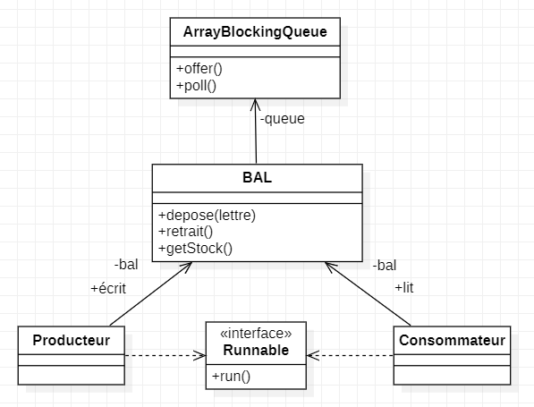

# Introduction

Ce dépôt Git servira de lieu de stockage pour tous les travaux pratiques liés au cours de programmation avancée. Il centralisera les codes et les exercices sur lesquels nous travaillerons, avec un focus particulier sur trois aspects majeurs : la programmation parallèle et répartie, la programmation concurrente, et la programmation client/serveur.

Ces différentes thématiques seront explorées à travers des exercices pratiques qui serviront de base pour le projet de SAÉ de ce semestre. L'objectif est d'acquérir une maîtrise suffisante de ces concepts afin de pouvoir les appliquer efficacement dans le cadre de ce projet.

Pour les diagrammes UML, je précise que je n'ai mis que les méthodes et les attributs pertinents des classes qui s'y figurent, par souci de clarté. Si vous voulez plus de détail, je vous invite à aller regarder le code par vous même, vous pouvez le faire en allant voir leur état au moment du commit correspondant à l'exercice.

Je précise également que ce rapport et ce dépot Git ont été créés vers la fin du TP3 de ce module. En effet, j'avais fait un premier dépôt Git sur lequel j'ai eu des problèmes liés à des push qui n'ont pas correctement été faits, résultant en la perte de mon premier rapport, ainsi que ma progression sur les TPs qui ne s'affichaient pas correctement sur Github. Ce faisant, j'ai décidé de recommencer à zéro, en commitant le code que j'avais fait pour les différents TPs et en rédigeant ce rapport au fur et à mesure. 

---

# Architecture matérielle

Au cours des différents TP que nous avons réalisé dans ce module, nous avons, à chaque fois que nous sommes allé dans de nouvelles salles, cherché les configurations matérielles des ordinateurs que nous avons utilisés :

|                           | G25                                                                                                 | I21                                                                                                 | G24                                                                                 |
|---------------------------|-----------------------------------------------------------------------------------------------------|-----------------------------------------------------------------------------------------------------|-------------------------------------------------------------------------------------|
| **CPU**                   | i7 4790, 4c/8t, 3.6GHz, 4.0GHz Turbo, 64-bit                                                        | i7 4790, 4c/8t, 3.6GHz, 4.0GHz Turbo, 64-bit                                                        | i7-12700T, 12c/20t (8p-core, 4e-core), 1.4GHz - 4.7GHz Turbo, 64-bit                |
| **RAM**                   | 8Go RAM Micron MT16KTF1G64AZ-1G6E1 DDR3 PC3L-12800U 2Rx8 1600MHz 1.35v CL11                         | 2x8Go RAM Micron MT16KTF1G64AZ-1G6E1 DDR3 PC3L-12800U 2Rx8 1600MHz 1.35v CL11                       | 2x32Go RAM Micron MTC16G2085S1SC-48BA1 SODIMM-DDR5 PC5-38400 2Rx8 4800MHz 1.1v CL40 |
| **GPU**                   | eGPU Intel, Intel® HD Graphics 4600, Mémoire vidéo maxi du sous-ensemble graphique 2Go RAM for VRAM | eGPU Intel, Intel® HD Graphics 4600, Mémoire vidéo maxi du sous-ensemble graphique 2Go RAM for VRAM | eGPU Intel, Intel® HD Graphics 770, 32 cores, 300MHz - 1.5GHz Turbo                 |
| **Disque**                | LITEONIT LCS-256L9S-11 256Go, 2.5", 7mm SATA 6Gb/s                                                  | LITEONIT LCS-256L9S-11 256Go, 2.5", 7mm SATA 6Gb/s                                                  | SOLIDIGM SSDPFKNU512GZ 512Go M.2 NVMe PCIe                                          |
| **Type de disque**        | SSD                                                                                                 | SSD                                                                                                 | SSD                                                                                 |
| **Fichier de pagination** | Oui                                                                                                 | Oui                                                                                                 | Oui                                                                                 |
| **Fichier d’échange**     | Oui                                                                                                 | Oui                                                                                                 | Oui                                                                                 |

La raison pour laquelle nous l'avons fait est, tout d'abord, car une grande partie du cours porte sur ces architectures matérielles, et notamment sur la caractérisation des processeurs (multi-core, multi-threads...). Mais également, parce que les performances des threads (que nous allons énormément utiliser par la suite) peuvent varier en fonction de la capacité de traitement parallèle des machines.

Toutes ces informations peuvent être obtenues sur windows simplement en allant dans le Gestionnaire des Tâches et en allant voir les composants. On peut ensuite chercher la carte graphique, le processeur etc sur internet pour avoir les informations voulues.

---

# TP1

L'énoncé du premier TP consiste à simuler le mouvement d'un ou plusieurs mobiles en utilisant des threads.

## Qu'est-ce qu'un Thread?

Un **thread** est une unité d'exécution indépendante dans un programme (ou Processus léger). Les threads partagent la même zone mémoire, et permettent d'exécuter plusieurs tâches en parallèle, ce qui est particulièrement utile pour des simulations comme celle-ci, où plusieurs objets (ici des "mobiles") doivent bouger simultanément sans bloquer l'interface utilisateur ou d'autres processus.

### Processus léger : cycle de vie

Un **thread** suit trois états principaux :

1. **Prêt** : Le thread est prêt à être exécuté, mais attend qu'un cœur de processeur soit disponible.
2. **En exécution** : Le thread est sélectionné par l'OS et utilise les ressources du processeur.
3. **Bloqué** : Le thread est suspendu (volontairement ou par l'OS) et attend qu'une ressource devienne disponible.

### Gestion par l'OS

L'OS décide quels threads sont exécutés et sur quels cœurs. Nous, on ne contrôle que leur synchronisation. L'OS peut interrompre un thread et le reprendre sur un autre cœur sans avoir besoin de nous demander ni de nous en informer.

### Premier lancement et fin

Le premier démarrage d'un thread via `start()` est initié par nous, mais ensuite, l'OS gère son exécution. Quand un thread termine la méthode `run()`, il disparaît définitivement.

[Pour en savoir plus sur les Threads.](https://fr.wikipedia.org/wiki/Thread)

## Exercice 1

L'exercice 1 nous demande d'implémenter le mouvement d'un mobile qui se déplace d'abord en avant, puis en arrière lorsqu'il atteint une extrémité de la fenêtre. Voici comment le code fonctionne :

1. **Classe `UnMobile` :**
    - Cette classe hérite de `JPanel` et implémente l'interface `Runnable`, ce qui lui permet d'exécuter son code dans un thread distinct.
    - Dans la méthode `run()`, deux boucles permettent au mobile de se déplacer. La première boucle déplace le mobile de gauche à droite, tandis que la seconde le fait revenir de droite à gauche. À chaque itération, le mobile est redessiné à sa nouvelle position grâce à la méthode `repaint()`, et un délai est introduit pour contrôler la vitesse de déplacement.

2. **Classe `UneFenetre` :**
    - Hérite de `JFrame` et constitue la fenêtre principale de l'application. Dans son constructeur, une instance de `UnMobile` est créée et ajoutée au conteneur de la fenêtre.
    - Un thread est démarré pour exécuter la méthode `run()` de l'objet mobile, permettant ainsi le mouvement en continu.

[Pour en savoir plus sur Swing.](https://docs.oracle.com/javase/8/docs/api/index.html?javax/swing/package-summary.html)

## Exercice 2

Dans l'exercice 2, la classe `UneFenetre` a été modifiée pour inclure un bouton qui permet de contrôler le mouvement du mobile. Pour ce faire, un `ActionListener` a été attaché au bouton pour gérer les événements de clic. Lorsque le bouton est cliqué, il vérifie son texte :
   - Si le texte est "Stop", cela signifie que le mobile doit être arrêté. Le texte du bouton est changé en "Start", et la méthode `suspend()` est appelée sur le thread du mobile pour le mettre en pause.
   - Si le texte est "Start", le mobile doit reprendre son mouvement. Le texte du bouton est alors réinitialisé en "Stop", et la méthode `resume()` est appelée pour relancer le thread.

Cependant, ce code ne fonctionne pas. En effet, les méthodes `suspend()` et `resume()` de la classe `Thread` sont considérées comme dépréciées et ne sont plus recommandées - et dans ce cas, ne fonctionnent plus - pour la gestion des threads en Java.

Pour l'exercice 3, nous allons donc utiliser d'autres méthodes pour que ce dernier fonctionne.

## Exercice 3

Nous avons étendu la fonctionnalité de notre application pour permettre le contrôle indépendant de deux mobiles en utilisant des boutons. Voici les principales modifications et le fonctionnement du code :

1. **Gestion de deux mobiles :**
   - Au lieu d'avoir un seul mobile, on a maintenant **deux objets `UnMobile`** (un pour chaque mobile). Ces objets sont ajoutés dans une grille de 2x2 via un `GridLayout`, ce qui permet de bien structurer l'interface avec deux mobiles et leurs boutons correspondants.

2. **Ajout d'un deuxième bouton de contrôle :**
   - Chaque mobile a son propre bouton (`sonBouton1` pour le premier mobile et `sonBouton2` pour le deuxième). Ces boutons permettent de stopper ou de relancer le mouvement de chaque mobile individuellement, en modifiant l'état de pause du mobile associé.

3. **Mécanisme de pause/résumé via un drapeau (`enPause`) :**
   - Les méthodes `suspend()` et `resume()` étant dépréciées, elles ont été remplacées par un mécanisme basé sur un **drapeau (`enPause`)**.
   - Chaque mobile vérifie régulièrement si le drapeau est activé, et si c'est le cas, le thread met le mobile en pause en restant dans une boucle qui attend que le drapeau soit désactivé.
   - La méthode `setPause()` permet de modifier l'état du drapeau, ce qui est contrôlé par le bouton correspondant. Quand l'utilisateur clique sur un bouton, il met à jour l'état de pause du mobile (true pour pause, false pour reprendre).

C'est dans cet exercice qu'on voit vraiment l'intérêt des threads, car les deux mobiles étant lancés dans des processus différents, il est possible pour l'un de rester dans une boucle à attendre tandis que l'autre continue sa route.

Au final, on a donc une fenêtre avec deux mobiles qui se déplacent simultanément et indépendamment l'un de l'autre, avec la possibilité de les arrêter ou de les relancer individuellement via leurs boutons respectifs.

---

# TP2

L'objectif est de faire afficher simultanément deux messages distincts, "AAA" et "BB". Toutefois, ces messages ne doivent pas se mélanger à l'écran. Les sorties doivent être soit **AAABB** ou **BBAAA**, mais surtout pas de mélange du style **ABABA** ou **AABBA**.

Le problème, c'est que les deux tâches accèdent à la ressource critique (l'affichage) en même temps, sans aucune coordination. Comme les threads sont exécutés en parallèle, ils peuvent interrompre l'affichage de l'autre, ce qui provoque un mélange des caractères à l'écran.

## Section critique

Cette situation est due à l'absence de **section critique**, une portion de code où une tâche doit avoir un accès exclusif à la ressource critique (ici, l'écran) pour éviter que les autres tâches interfèrent. Autrement dit, c'est une section où il ne faut laisser qu'un seul thread s'exécuter à la fois.

Une façon de résoudre ce problème est d'utiliser un **verrou Mutex** (mutual exclusion). Le Mutex permet à un seul thread d'accéder à une ressource critique à la fois, bloquant les autres jusqu'à ce que le thread ayant verrouillé le Mutex le libère. Cela garantit qu'à tout moment, une seule tâche peut entrer dans la section critique. En java, il suffit d'ajouter le mot `synchronized` à la déclaration d'une méthode pour que celle-ci puisse être verrouillée.

[Pour en savoir plus sur les sections et les ressources critiques.](https://ecampus.paris-saclay.fr/pluginfile.php/3446722/mod_resource/content/1/CM2-thread-java-et-sectionCritique.pdf)

## Sémaphore

Il existe derrière plusieurs façons de gérer ces verrous, mais celle qu'on va utiliser, c'est le **sémaphore**. Il fonctionne comme un compteur : il autorise l'accès à la ressource si une valeur (appelée `valeurInitiale`) est positive, et décrémente ce compteur lorsque la ressource est accédée. Une fois que la tâche a terminé, elle incrémente le compteur pour libérer la ressource et permettre à une autre tâche d'y accéder.

Le mot "sémaphore" vient des systèmes de signalisation visuelle utilisés en mer pour communiquer avec les bateaux, notamment pour réguler leur accostage. En informatique, l'analogie est similaire : le sémaphore régule l'accès aux ressources partagées entre différents threads, empêchant les conflits d'accès.

Du coup, concrètement, comment le sémaphore fonctionne en code ? Lorsqu'une tâche veut entrer dans la section critique (l'affichage dans notre cas), elle appelle la méthode `syncWait()` du sémaphore (qui décrémente le compteur). Si la valeur du sémaphore est positive, la tâche peut accéder à la ressource, sinon elle doit attendre que la ressource soit libérée. Une fois la section critique terminée, la tâche appelle la méthode `syncSignal()` (qui incrémente le compteur), libérant ainsi la ressource pour les autres processus.

[Pour en savoir plus sur les sémaphores.](https://fr.wikipedia.org/wiki/S%C3%A9maphore_(informatique))

## Exercice 1

Dans cet exercice, nous avons utilisé un **sémaphore binaire**, ce qui veut dire que la `valeurInitiale` commence à 1, ne laissant ainsi qu'un seul thread accéder à la ressource à la fois.

1. **Classe `semaphore` et `semaphoreBinaire`** :  
   Ce sont les classes dont nous avons déjà parlé, semaphore implémente les méthodes `syncWait()` et `syncSignal`, et semaphoreBinaire mets juste la `valeurInitiale` à 1.

2. **Classe `Affichage`** :  
   Chaque tâche (TA et TB) correspond à un thread `Affichage` qui essaie d'imprimer son texte ("AAA" ou "BB"). Avant de commencer à afficher, la méthode `run()` appelle `syncWait()` pour attendre son tour. Ensuite, le texte est affiché caractère par caractère. Une fois terminé, le sémaphore est relâché avec `syncSignal()`, permettant à l'autre thread d'accéder à la ressource.

3. **Classe `Main`** :  
   Ici, un sémaphore binaire est initialisé, et est donné en paramètre aux deux threads TA et TB avant d'être lancés. Le sémaphore gère l'ordre dans lequel ces threads affichent leur texte, assurant que l'un doit terminer avant que l'autre puisse commencer.

## Exercice 2

Bon celui-ci était assez simple, et visait simplement à tester ma compréhension des sections critiques. Il suffit de faire afficher "J'entre en section critique" quand une tâche décrémente la valeur du sémaphore, et "Je sors de section critique" quand elle l'incrémente, puisque c'est les moments où elle accède à la ressource et où elle la libère.

## Exercice 3

Cet exercice ne figure pas dans le TP2 de base, et pourtant c'est sûrement le plus important. On reprends le code du TP1 avec les mobiles, mais avec quelques modifications importantes. L'affichage est maintenant divisé en trois sections : une section gauche, une section droite, et une section centrale qui sert de **section critique**.

On oublie les boutons qui permettent d'arrêter et de reprendre les mobiles, la particularité ici est que la section centrale, étant critique, ne peut être traversée que par un nombre limité de mobiles à la fois, pour simuler visuellement les processus en attente. Pour bien visualiser ça, on a plus 1 ou 2 mobiles, mais bien une vingtaine qui circulent de gauche à droite à l'infini.

### Sémaphore Général

Pour gérer ce contrôle d'accès à la section critique, nous allons utiliser un **sémaphore général**. C'est l'implémentation la plus simple possible d'un sémaphore, on doit simplement lui donner la `valeurInitiale` en entrée, et il agira en conséquence. Par exemple, un sémaphore général de `valeurInitiale` 5 laissera 5 tâches accéder à la ressource avant de bloquer les autres.

Je précise ici que, pour ne pas avoir à répéter des fichiers de code sans raison, et par souci d'organisation, cet exercice sera réalisé dans le package **TP1**, bien qu'il s'agisse d'un exercice du TP2.

### Fonctionnement

1. **Classe `semaphore` et `semaphoreGeneral`** :

  - Le **sémaphore général** est une extension de la classe `semaphore`, avec une valeur initiale définissant combien de mobiles peuvent simultanément entrer dans la section critique.
  - La méthode `syncWait()` décrémente la valeur du sémaphore et met un thread en attente si la valeur est à 0, tandis que `syncSignal()` réincrémente la valeur une fois qu'un mobile sort de la section critique, permettant à un autre d'y entrer.

2. **Classe `UnMobile`** :

  - Chaque mobile est représenté par un objet `UnMobile`, qui se déplace de gauche à droite dans la fenêtre. Son mouvement est divisé en trois sections : la première avant la section critique, la section critique elle-même, et la dernière après la section critique.
  - Lorsqu'un mobile atteint la section critique (représentée par un changement de couleur en rouge), il appelle `sonSemaphore.syncWait()` pour vérifier si la section critique est accessible. Si le nombre de mobiles autorisés est atteint, il attend. Une fois à l'intérieur, la couleur repasse au noir et le mobile traverse la section. Quand il sort de cette section, il appelle `syncSignal()` pour libérer l'accès à d'autres mobiles.

3. **Classe `UneFenetre`** :

  - Cette classe représente la fenêtre contenant tous les mobiles. Le conteneur est divisé en 20 lignes avec un seul mobile par ligne. Un **sémaphore général** est créé avec une valeur initiale de 5, ce qui signifie que seulement 5 mobiles peuvent traverser la section critique simultanément.
  - Chaque mobile est lancé dans un thread séparé et se déplace à une vitesse aléatoire, simulant ainsi un trafic continu de mobiles voulant accéder à la section centrale (critique).

---

# TP3

Ici, nous devons résoudre un problème de communication entre plusieurs threads à travers une ressource critique, en l'occurrence une **boîte aux lettres** (BAL). L'objectif est de permettre à des entités distinctes de **déposer** et de **retirer** des objets (ici des lettres) de cette BAL sans que des erreurs de concurrence n'apparaissent.

Ce que l'on va chercher absolument à éviter, c'est ces deux situations :
- Un thread tente de déposer une lettre alors que la BAL est déjà pleine, et reste donc bloqué.
- Un thread essaye de retirer une lettre d'une BAL vide, et reste donc bloqué.

## Utilisation d'un Moniteur

Pour répondre à cette problématique, nous allons utiliser un **moniteur**. Un moniteur est un objet de synchronisation utilisé pour contrôler l'accès à une ressource critique par plusieurs threads, comme le sémaphore. Mais la différence ici c'est que ce sont les méthodes de la classe Moniteur qui sont le point d'entrée des Threads.

Un moniteur fonctionne de la manière suivante :
- **Exclusion Mutuelle** : Un seul thread à la fois peut accéder aux méthodes ou sections de code critiques.
- **Condition(s) à valider** : Les threads sont suspendus lorsqu'une condition particulière n'est pas remplie (par exemple, une BAL pleine ou vide). Ce n'est qu'une fois la condition vérifiée (grâce à `notifyAll()`) que les threads sont réveillés et peuvent reprendre leur exécution.

L'utilisation du moniteur permet de s'assurer que :
- Un thread producteur attendra si la BAL est pleine avant d'ajouter une nouvelle lettre.
- Un thread consommateur attendra qu'une lettre soit disponible dans la BAL avant de la retirer.

[Pour en savoir plus sur les Moniteurs.](https://fr.wikipedia.org/wiki/Moniteur_(programmation))

## Modèle Producteur/Consommateur

Le cadre de ce TP nous demande donc d'implémenter le modèle **Producteur/Consommateur**. Ce modèle décrit deux types d'entités :
- Le **producteur**, qui génère des ressources (ici, des lettres) et les dépose dans une ressource critique.
- Le **consommateur**, qui prélève ces ressources et les traite.

La BAL joue le rôle de ressource intermédiaire de Moniteur entre ces deux entités. Le producteur doit s'assurer que la BAL n'est pas pleine avant d'y ajouter une lettre, et le consommateur doit vérifier que la BAL contient une lettre avant d'essayer de la retirer. Les deux entités fonctionnent de manière **asynchrone**, mais sont synchronisées via la BAL, en utilisant les méthodes de synchronisation.

## Exercice 1

### I1

1. La Classe `BAL`

La classe `BAL` (Boîte Aux Lettres) représente la ressource critique entre le producteur et le consommateur. Elle contient :
- Une méthode **synchronisée `depose()`** qui permet au producteur de déposer une lettre. Si la BAL est pleine, le thread producteur attend jusqu'à ce qu'une lettre soit retirée.
- Une méthode **synchronisée `retrait()`** qui permet au consommateur de retirer une lettre. Si la BAL est vide, le thread consommateur attend jusqu'à ce qu'une nouvelle lettre soit déposée.

2. La Classe `Producteur`

Le **Producteur** est un thread qui génère et dépose des lettres dans la BAL. Il effectue cette opération de manière répétée jusqu'à la fin de sa tâche, marquée par la lettre spéciale 'Q'. Avant de déposer une lettre, il vérifie que la BAL n'est pas pleine pour éviter un conflit.

3. La Classe `Consommateur`

Le **Consommateur** est un autre thread qui lit et retire les lettres de la BAL. Il attend qu'une lettre soit déposée si la BAL est vide, et continue de consommer les lettres jusqu'à ce qu'il rencontre la lettre 'Q', qui indique la fin du processus.

### I2

Cette partie demande là encore assez peu de changements par rapport à la version précédente. L'objectif est simplement de permettre à l'utilisateur d'entrer manuellement chaque lettre que le producteur va insérer dans la boîte aux lettres (BAL), plutôt que de définir une liste de lettres à l'avance.

Pour ce faire, on a simplement modifié la classe Producteur de manière à ce qu'elle demande à l'utilisateur d'entrer une lettre à chaque itération. Tant que l'utilisateur n'entre pas la lettre 'Q', le programme continue de fonctionner. Voici les modifications essentielles :
- La méthode `run()` du Producteur est modifiée pour utiliser un Scanner. Ce dernier permet à l'utilisateur de saisir une lettre à chaque itération.
- Boucle conditionnelle : la boucle continue tant que la lettre entrée n'est pas 'Q'. Lorsque l'utilisateur entre 'Q', le thread producteur s'arrête et le programme se termine.
- Le champ `lettres` disparaît étant donné qu'on n'utilise plus une liste finie de lettres.
- La méthode `main()` ne génère plus cette liste.

Et le reste du code reste inchangé. Cette approche fonctionne bien, mais un petit problème peut survenir. En effet, après que le programme demande à l'utilisateur d'entrer une lettre, il est possible - et à vrai dire, ça arrive quasiment tout le temps -  que le consommateur retire une lettre de la BAL **avant** que l'utilisateur puisse écrire. Dans ce cas, la sortie du consommateur s'afficher dans la boîte de dialogue.

Cela peut entraîner une situation un peu déroutante, où des messages comme "Consommateur a lu : A" apparaissent dans la boîte d'insertion de texte de l'utilisateur. Cela ne cause pas de problème au niveau fonctionnel, mais cela peut rendre l'interface utilisateur un peu confuse.

Pour résoudre ce problème, il faudrait s'assurer que le Scanner fonctionne de manière isolée et n'interfère pas avec les sorties du consommateur, mais ça voudrait dire qu'il faut traiter l'entrée utilisateur comme un thread à part entière, ce qui complique beaucoup le code pour pas grand chose.

## Exercice 2

Pour cet exercice, nous allons suivre les instructions du [blog de José Paumard](https://blog.paumard.org/cours/java-api/chap05-concurrent-queues.html) pour explorer une approche avancée du modèle Producteur/Consommateur en Java. Ce blog propose une structure de code utilisant l’API Concurrent et la classe BlockingQueue, qui facilitent la gestion des files d’attente et la synchronisation des threads.

L’objectif de cette deuxième partie sera donc d’adapter les éléments décrits sur le blog à notre propre modèle. Concrètement, ça veut juste dire qu'on garde nos éléments Producteur, Consommateur et BAL au lieu de Boulanger, Mangeur et Boulangerie. De plus, la classe Pain ne sera pas nécessaire ici étant donné que ce ne sont que des strings.

### L’API Concurrent

L’API Concurrent de Java offre un ensemble d’outils pour la programmation multithread et la gestion des tâches concurrentes (d'où le nom). Elle fournit des classes et interfaces pour synchroniser l’accès aux ressources critiques, gérer des tâches asynchrones et contrôler le comportement des threads sans recourir aux traditionnels blocs `synchronized`.

On va principalement utiliser l’API Concurrent pour ses collections sécurisées pour le multithreading, et notamment ce qui va principalement nous intéresser, des **files d'attente bloquantes** pour simplifier les interactions entre producteurs et consommateurs. Mais il faut savoir qu'elle inclut aussi des outils de synchronisation comme les sémaphores, justement.

### La BlockingQueue

La `BlockingQueue` est une structure de données spécialement conçue pour gérer la synchronisation entre plusieurs threads. Elle est dite bloquante car elle est capable de mettre en pause automatiquement un thread en attente d'une opération. Par exemple :
- Si le producteur essaie d’ajouter une lettre mais que la file est pleine, la BlockingQueue le met en pause jusqu’à ce qu’une place se libère. (C'est ce que fait la méthode `put()`)
- Si le consommateur tente de retirer une lettre alors que la file est vide, elle le met en pause jusqu’à ce qu’une nouvelle lettre soit disponible. (C'est ce que fait la méthode `take()`)

Avec une BlockingQueue, on n’a plus besoin de gérer nous-mêmes les blocages et les notifications des threads (`synchronized`, `wait()`, `notifyAll()`), car elle se charge de tout cela automatiquement.

[Pour en savoir plus sur l'API Concurrent et la BlockingQueue.](https://docs.oracle.com/javase/8/docs/api/?java/util/concurrent/BlockingQueue.html)

### Adaptation du code

1. Changement de BAL : 

`BAL` utilisera maintenant une `BlockingQueue<String>` au lieu d’une simple variable `lettre`. Cela lui permettra de gérer directement les lettres comme une file d'attente, sans besoin de synchronisation explicite. Ses méthodes `déponse()` et `retrait()` ne sont désormais plus que des wrappers des méthodes `offer()` et `poll()` de `BlockingQueue`.

2. Classe Producteur :

Le producteur insérera désormais les lettres dans `BAL` via la méthode `depose()`, qui bloque automatiquement si la file est pleine. De plus, on retire le changement où on écrit nous même les lettres. Il fera toutes les lettres et terminera par "*", ce qui tuera les processus. (rôle du `PainEmpoisonne` dans le blog.)

3. Classe Consommateur :

Le consommateur retirera les lettres avec la méthode `retrait()`, qui bloque si la file est vide. Nous n’avons plus besoin d’écrire des boucles d’attente ou des vérifications d’état puisque la `BlockingQueue` s’occupe de ces aspects. Si la lettre est "*", le thread s'arrête.

4. Classe MainTP3 :

Au lieu d'instancier un producteur et un consommateur, on va en instancier plusieurs. 4 producteurs et 3 consommateurs, pour être précis.

### Résultat

Les producteurs étant plus nombreux que les consommateurs, ils terminent de mettre l'alphabet bien avant que les consommateurs ne puissent retirer de lettre vide. Ce qui fait qu'au final, le programme se termine avec les consommateurs qui prennent les lettres dans l'ordre alors que plus aucune lettre n'est déposée.

Il y a un dernier petit problème que je n'arrive pas à résoudre, qui est que lorsque les consommateurs arrivent à "*", l'un d'entre eux, et ce peu importe le nombre de consommateurs que je mets, tire une lettre "null". Ce qui, logiquement, ne devrait pas pouvoir arriver.